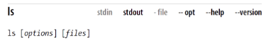

# Linux Pocket Guide

Welcome to Linux! If you’re a new user, this notes can serve as a quick introduction, as well as a guide to common and practical commands. If you have Linux experience, feel free to skip the introductory material.

### Linux Command Example

Here’s an example command that counts lines of text in a file, `myfile`

```sh
> wc -l myfile
```

Here we will cover the most important Linux commands for the average user, such as `ls`(list files), `grep`(search for text),
`mplayer`(play audio and video files), and `df`(measure free disk space).

### What’s Linux

Linux is a popular, open source operating system that competes with Microsoft Windows and Mac OS X. Like these other operating systems, Linux has a graphical user interface with win‐dows, icons, and mouse control. However, the real power of Linux comes from its command-line interface, called the `shell`,for typing and running commands like the preceding `wc`.

### What is a Command or Anatomy of Command

A Linux command typically consists of a _program name_ followed by `options` and `arguments`, typed within a shell, like this:

```sh
> wc -l myfile
```

Here the program name `wc`, short for `word count` refers to a program somewhere on disk that the shell will locate and run. Options, which usually begin with a `dash`, affect the behavior of the program. In the preceding command, the `-l` option tells `wc` to count lines and not words. The argument myfile specifies the file that wc should read and process.

Commands can have multiple options and arguments. Options may be given individually:

```sh
> wc -l -w myfile      # Two individual arguments
```

of command after a single dash:

```sh
> wc -lw myfile        # same as -l -w
```

or, can take multiple files

```sh
> wc -lw myfile myfile2      # count lines in two files
```

> Options are not standardized. They may be a single dash and one character (say, `-l`), two dashes and a word (`--lines`), or several other formats.
> Some options are followed by a value, such as- `s 10`, and space between them might not be required `(-s10)`.
> Likewise, arguments are not standardized. They usually represent `filenames for` input or output, but they can be other things too, like `directory names` or `regular expressions`.

### Shell prompts

Before you can type a command, you must wait for the shell to display a special symbol, called a prompt. A prompt means, “Iam waiting for your next command.”

Your prompt:

```sh
>
```

or a complex string of text containing your computer name, username, and possibly other information and symbols

```sh
localhost:~rucse$
```

Some command will print text on the screen as they run.

```sh
> wc -l myfile
18 files
```

Some commands are successfully only by an administrator, a special user with permission to do anything on the system (called `superuser or root`)

```sh
> sudo superuser commands goes here
```

Example:

```sh
> wc -l /etc/shadow       # This will fail
wc: /etc/shadow: Permission denied
```

```sh
> sudo wc -l /etc/shadow
Password: ******
51 /etc/shadow
```

### Command-line warm-up

To give you a feel for Linux, here are 10 simple commands you can try right now.

`Note`: commands name, options are case sensitive

Display a calender for April 2017

```sh
> cal apr 2017
    April 2017
Su Mo Tu We Th Fr Sa
                   1
 2  3  4  5  6  7  8
 9 10 11 12 13 14 15
16 17 18 19 20 21 22
23 24 25 26 27 28 29
30
```

List the contents of the /bin directory, which contains many commands

```sh
> ls /bin
2to3-2.7                            more                               xmodmap
7z                                  most                               xmore
7za                                 mount                              Xorg
...........................................................................................
```

Count the number of visible items in your home directory(represented here by a special variable `HOME` that we will discuss later):

```sh
> ls $HOME | wc -l
11
```

See how much space is used on a partition of your hard disk:

```sh
> df -h /

Filesystem      Size  Used Avail Use% Mounted on
/dev/sda2        99G   39G   55G  42%    /
```

Watch the processes running on your computer (type "q" to quit):

```sh
> top -d1
top - 10:18:21 up 54 min,  1 user,  load average: 1.55, 1.17, 1.10
Tasks: 277 total,   1 running, 276 sleeping,   0 stopped,   0 zombie
%Cpu(s): 15.4 us,  5.5 sy,  0.5 ni, 78.6 id,  0.0 wa,  0.0 hi,  0.0 si,  0.0 st
MiB Mem :   7868.2 total,    912.4 free,   4134.5 used,   2821.3 buff/cache
MiB Swap:   3898.0 total,   3890.6 free,      7.4 used.   2859.2 avail Mem 

    PID USER      PR  NI    VIRT    RES    SHR S  %CPU  %MEM     TIME+ COMMAND     
  19764 nahid     20   0 4851096 309860 107112 S  27.2   3.8   6:12.87 chrome      
  17490 nahid     20   0  628468 141360  77776 S   3.9   1.8   4:15.79 chrome      
   8250 nahid     20   0  901892  74332  43840 S   2.9   0.9   2:24.24 Xorg        
  28419 nahid     20   0   12320   3900   3256 R   2.9   0.0   0:00.09 top         
  22420 nahid     20   0 4589808 468632  42172 S   1.9   5.8   2:07.70 Microsoft.+ 
   4596 root      35  15   12032   8716   2212 S   1.0   0.1   0:05.04 preload     
  12532 nahid     20   0 4938516 310452 106932 S   1.0   3.9   2:58.63 gnome-shell 
  15208 nahid     20   0 1098316 327840 170164 S   1.0   4.1   1:30.69 chrome      
  16269 nahid     20   0  923528  57860  40620 S   1.0   0.7   0:09.93 gnome-term+ 
  16414 nahid     20   0   18.6g 284488 119140 S   1.0   3.5   3:22.70 code        
  17535 nahid     20   0 4646264 186248  57052 S   1.0   2.3   0:50.80 code        
```

See how long you've been logged in:

```sh
> last -1 $USER
nahid :0 :0   Fri Oct 23 09:25   still logged in
```

Download  a  file  sample.pdf  from  this  book’s  website  to  your current directory, without needing a web browser:

```sh
> wget http://linuxpocketguide.com/sample.pd
```

Display information about you computer's IP address

```sh
> ip addr show eth0
...
inet 192.168.1.21
```

See who owns the domain name oreilly.com (press the space bar to move forward page by page, and type “q” to quit):

```sh
> whois oreilly.com | less

Domain Name: OREILLY.COM
Registrar: GODADDY.COM, LLC
```

Finally, clear the windows:

```sh
> clear
```

```txt
General usage in a simple format:
ls [options..] [files..]
```



- `stdin`: The  command  reads  from  standard  input  (i.e.,  your  key‐board), by default. See “Input and Output” on page 15.

- `stdout`: The command   writes   to   standard   output   (i.e.,   your screen), by default. See “Input and Output” on page 15.

- `file`: When given a dash (-) argument in place of an input file‐name, the command reads from standard input;

#### Your friend, the `echo` command

```sh
> echo My dog has fleas
My dog has fleas
> echo My name is $USER    # Here USER is shell variable
My name is nahid.
```

#### Long command lines

Sometimes, a command will be too lengthy to fit on one line in the book. In these cases, we’ll split the command onto multiple lines that end with a backward slash character:

```sh
> echo This is a long command that does not fit on \
one line

This is a long command that does not fit on one line
```
